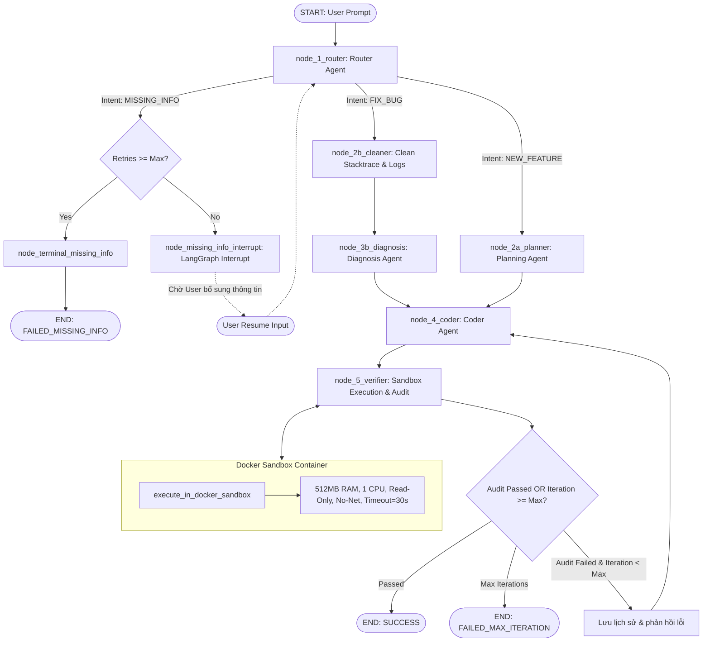

# AGENTS.md - AI Engineer Agent Guidance

## Project Overview
`ai_engineer_agent` là một hệ thống AI Software Engineering Agent được thiết kế theo kiến trúc đồ thị LangGraph với khả năng lập trình tự động, chẩn đoán lỗi (debugging), chạy code an toàn trong môi trường Docker Sandbox, và lưu giữ trạng thái phiên làm việc (state persistence) với SQLite Checkpointer.

---

## Key Tech Stack & Libraries
- **Language**: Python 3.11+
- **Agent Framework**: `langgraph`, `langchain-core`, `langchain-openai`
- **Checkpointing**: `langgraph-checkpoint-sqlite` (WAL Mode)
- **Data Contract & Validation**: `pydantic` v2
- **Sandbox Execution**: `docker` SDK (Docker containers với resource limits)
- **Environment Management**: `python-dotenv`

---

## Project Structure
```text
ai_engineer_agent/
├── schemas/
│   ├── __init__.py
│   └── payload.py          # Pydantic data contracts (AgentState, CodeFixProposal, VerifierAudit,...)
├── llm/
│   ├── __init__.py
│   └── safe_call.py        # Safe LLM wrapper (structured output, automatic schema retries, token counting)
├── sandbox/
│   ├── __init__.py
│   └── docker_runner.py    # Isolated execution environment (Docker container runner, limits)
├── agent/
│   ├── __init__.py
│   ├── nodes.py            # Main graph node handlers (Router, Interrupt, Planner, Cleaner, Diagnosis, Coder, Verifier)
│   └── graph.py            # LangGraph StateGraph builder, conditional routing, SqliteSaver integration
├── main.py                 # API wrapper functions (start_agent_session, resume_agent_session, close_db_connection)
├── agent_sessions.db       # SQLite DB persistence file (auto-generated)
├── agent_sessions.db-wal   # SQLite WAL file (auto-generated)
├── agent_sessions.db-shm   # SQLite Shared Memory file (auto-generated)
├── .env                    # Environment variables (OPENAI_API_KEY, DB_PATH)
├── .gitignore              # Ignores .db*, .env, __pycache__
├── requirements.txt        # Package dependencies
├── README.md               # Setup & usage instructions
└── AGENTS.md               # AI Agent project guidance & rules
```

---

## Core Architecture & Workflow Rules

### 1. Data Contracts (`schemas/payload.py`)
- Mọi dữ liệu luân chuyển giữa các node, Frontend, và LLM Prompts đều tuân thủ duy nhất chuẩn Pydantic trong [`schemas/payload.py`](schemas/payload.py).
- Key Models:
  - [`AgentState`](schemas/payload.py:114): State chính chứa lịch sử, tokens, status, input, plan, diagnosis, proposal, sandbox_result, audit_result.
  - [`CodeFixProposal`](schemas/payload.py:70): Đảm bảo `entrypoint_filename` thuộc danh sách files, khớp với phần mở rộng của `language`, và ngăn chặn danh sách file bị trùng lặp (duplicate filenames).
  - [`VerifierAudit`](schemas/payload.py:105): Đánh giá độ tin cậy và phản hồi của Verifier Agent.

### 2. LLM Communication Layer (`llm/safe_call.py`)
- Hàm [`safe_llm_call()`](llm/safe_call.py:8) bọc gọi `with_structured_output(schema_class)`.
- Tự động bắt lỗi Pydantic Validation Error và retry kèm phản hồi lỗi ngược lại cho LLM (tối đa `max_retries=3`).
- Thu thập token usage chi tiết theo model_name và node_name.

### 3. Isolated Execution Sandbox (`sandbox/docker_runner.py`)
- Hàm [`execute_in_docker_sandbox()`](sandbox/docker_runner.py:30) chạy mã nguồn được tạo ra bên trong Docker container cách ly (`python:3.11-slim` hoặc `node:20-slim`).
- Bắt buộc áp dụng giới hạn tài nguyên và cấu hình bảo mật nâng cao:
  - Giới hạn phần cứng: `mem_limit="512m"`, `pids_limit=100`, `nano_cpus=1000000000` (1 CPU core), `timeout_seconds=30`.
  - Tách biệt môi trường & Network: `network_disabled=True`, `tmpfs={'/tmp': 'rw,size=32m,noexec'}`.
  - Phân quyền & Bảo mật nâng cao: `user="1000:1000"`, `cap_drop=["ALL"]`, `security_opt=["no-new-privileges:true"]`, `read_only=True` (chỉ cho phép ghi vào thư mục `/app` được mount tạm và `/tmp` của tmpfs).
  - Ngăn chặn Path Traversal và Safe Tên File: Mọi đường dẫn/file name của Proposal được xác thực thông qua `_is_safe_filename` trong `schemas/payload.py` và gộp đường dẫn cô lập an toàn bằng `_safe_join` trong `sandbox/docker_runner.py`.
  - Xử lý Timeout & Race Condition: Bọc `container.kill()` và `container.remove(force=True)` trong `try/except` an toàn nhằm chống lại race conditions (409 Conflict/Already exited hoặc 404 Not Found) khi container vừa kết thúc đúng lúc timeout.

### 4. Graph Architecture (`agent/graph.py` & `agent/nodes.py`)
- **Workflow Flowchart (Mermaid)**:


- **Node Routing Flow**:
  1. `node_1_router`: Phân loại Intent (`MISSING_INFO`, `FIX_BUG`, `NEW_FEATURE`).
  2. Rẽ nhánh theo `route_after_router()`:
     - `MISSING_INFO` -> `node_missing_info_interrupt` (Pause chờ user bổ sung thông tin qua LangGraph `interrupt`).
     - `FIX_BUG` -> `node_2b_cleaner` -> `node_3b_diagnosis` -> `node_4_coder`.
     - `NEW_FEATURE` -> `node_2a_planner` -> `node_4_coder`.
  3. `node_4_coder` -> `node_5_verifier` (Chạy sandbox + Audit).
  4. Rẽ nhánh theo `route_after_verifier()`:
     - Nếu thành công (`SUCCESS`) hoặc vượt quá số vòng tối đa (`FAILED_MAX_ITERATION`) -> `END`.
     - Ngược lại -> Quay lại `node_4_coder` để sửa lỗi.

### 5. API Services & Persistence (`main.py`)
- Khởi tạo SQLite Checkpointer ở chế độ **WAL Mode** (`PRAGMA journal_mode=WAL; PRAGMA busy_timeout=5000;`).
- Cơ chế **Thread-Safe** đồng thời an toàn về dữ liệu: Dùng `threading.RLock()` (`db_lock`, reentrant) bao quanh `graph.stream` và `graph.get_state` để đồng bộ hóa truy cập checkpoint DB. **Kiến trúc Trade-off**: `SqliteSaver` (sync, dùng chung 1 connection) được thiết kế cho single-writer. Với `db_lock` bọc ngoài `graph.stream()`, mỗi session chạy **tuần tự** — tại một thời điểm chỉ 1 session thực thi LLM + Docker, các request khác xếp hàng chờ. Đây là đánh đổi an toàn-tuyệt-đối cho concurrency. Nếu cần throughput cao hơn (nhiều user thật), xem xét: (1) `AsyncSqliteSaver` + FastAPI async endpoints, (2) mỗi thread/request một connection SQLite riêng (WAL + OS file-lock đã hỗ trợ), hoặc (3) `langgraph-checkpoint-postgres`.
- **Lazy Initialization (Kiểm tra API Key)**: Chuyển kiểm tra `OPENAI_API_KEY` và khởi tạo graph vào hàm getter (`get_llm_clients()`, `get_verifier_graph()`) thay vì chặn ở top-level module, cho phép import module để unit test mà không bị gián đoạn.
- Expose các hàm API wrapper chuẩn:
  - [`start_agent_session(thread_id, user_input, auto_cleanup=False)`](main.py:123)
  - [`resume_agent_session(thread_id, user_answer, auto_cleanup=False)`](main.py:181)
  - [`close_db_connection()`](main.py:106)
- **Database Cleanup & Maintenance Helpers** (giải quyết hiện tượng phình `.db`/WAL khi chạy local lâu dài):
  - [`delete_thread_data(thread_id)`](main.py:71): Xóa trực tiếp checkpoint history của 1 thread bằng API chính thức `checkpointer.delete_thread(thread_id)` (đầy đủ, an toàn, tự động xử lý mọi bảng nội bộ của LangGraph Checkpointer), đồng thời xóa dòng tracking tương ứng trong bảng `session_completions`.
  - [`cleanup_old_sessions(days_retention=7)`](main.py:86): Dọn dẹp các checkpoint cũ hơn N ngày thông qua bảng theo dõi độc lập `session_completions` (nhằm thay thế cho việc dựa vào cột `timestamp` vốn không tồn tại trong schema nội bộ của SqliteSaver) và thực hiện `PRAGMA wal_checkpoint(TRUNCATE)` để gom WAL (phù hợp chạy định kỳ/cronjob).
  - [`close_db_connection()`](main.py:106): Flush WAL vĩnh viễn vào file `.db` chính và đóng kết nối an toàn (sẵn sàng gắn vào FastAPI shutdown event).
  - Tham số `auto_cleanup=True` trong `start_agent_session` / `resume_agent_session` sẽ tự động xóa checkpoint của thread ngay khi session kết thúc (hoặc gặp lỗi).

---

## 6. Testing & Verification Rules (BẮT BUỘC)

- **Trước khi báo cáo bất kỳ thay đổi code nào là "đã hoàn tất"**, PHẢI chạy:
  ```bash
  pytest -m "not integration" -q
  ```
  Nếu có test fail, PHẢI sửa cho tới khi pass — không được coi task là xong
  khi còn test đỏ, và không được xóa/sửa test chỉ để làm nó pass mà không
  sửa nguyên nhân gốc.

- **Nếu thay đổi động chạm tới `sandbox/docker_runner.py`** hoặc bất kỳ logic
  thực thi Docker nào (resource limits, timeout, network, filesystem
  permissions), PHẢI chạy thêm (yêu cầu Docker daemon đang chạy):
  ```bash
  pytest -m integration -q
  ```

- **Khi thêm node mới, sửa schema, hoặc đổi routing logic**: phải viết kèm
  unit test tương ứng trong `tests/` theo đúng cấu trúc hiện có
  (`test_payload.py`, `test_graph_routing.py`, `test_nodes.py`, ...).
  Không merge/hoàn tất logic mới mà thiếu test cho nó.

- **Không mock/patch để né việc gọi LLM hoặc Docker thật trong test integration**
  — nhóm `@pytest.mark.integration` tồn tại chính là để xác nhận các rào chắn
  bảo mật (`network_disabled`, `read_only`, `cap_drop`) có tác dụng thật, không
  chỉ đúng trên giấy.

- Kiểm tra coverage định kỳ để phát hiện vùng code chưa được test:
  ```bash
  pytest --cov=. --cov-report=term-missing -m "not integration"
  ```

- Cài `pre-commit` một lần để tự động hóa bước đầu (`pip install pre-commit
  && pre-commit install`) — từ đó mọi lệnh `git commit` (kể cả do AI agent
  chạy qua CLI) sẽ tự chạy `pytest -m "not integration"` trước khi cho phép
  commit đi qua.

---

## Development & Maintenance Rules(IMPORTANT)

1. **Modular Consistency**: Khi thêm node mới, đặt handler vào `agent/nodes.py`, khai báo route/edges trong `agent/graph.py`, và re-export tại `agent/__init__.py`.
2. **Data Model Updates**: Cập nhật `schemas/payload.py` khi thay đổi dữ liệu state hoặc giao tiếp với LLM.
3. **No Hidden Imports**: Bắt buộc import theo cấu trúc package chuẩn (`from schemas.payload import ...`, `from llm.safe_call import ...`).
4. **Documentation Updates**: Cập nhật cả `README.md` và `AGENTS.md` khi thay đổi luồng hoặc thêm tính năng mới.
