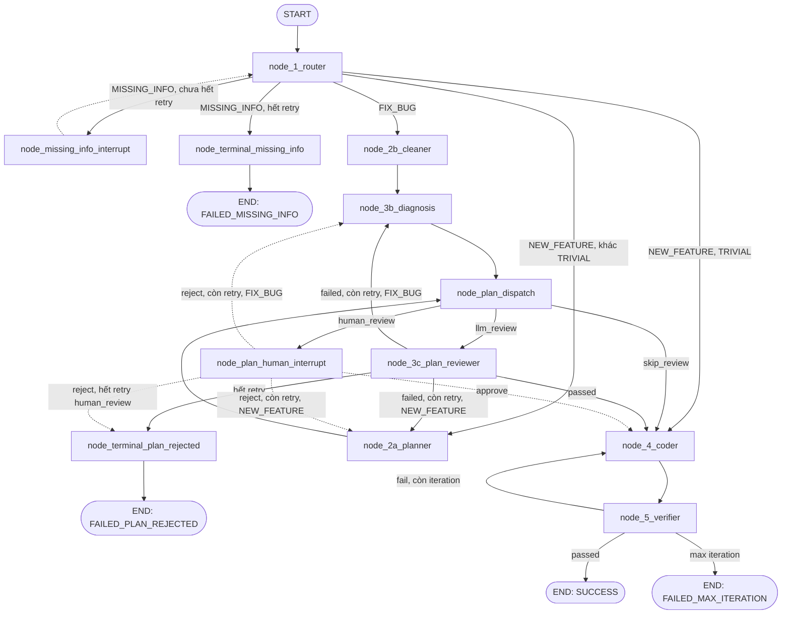

# AGENTS.md - AI Engineer Agent Guidance

## Project Overview
`ai_engineer_agent` là một hệ thống AI Software Engineering Agent được thiết kế theo kiến trúc đồ thị LangGraph với khả năng lập trình tự động, chẩn đoán lỗi (debugging), chạy code an toàn trong môi trường Docker Sandbox, và lưu giữ trạng thái phiên làm việc (state persistence) với SQLite Checkpointer.

---

## Key Tech Stack & Libraries
- **Language**: Python 3.11+
- **Agent Framework**: `langgraph`, `langchain-core`, `langchain-openai`
- **Checkpointing**: `langgraph-checkpoint-sqlite` (WAL Mode)
- **Data Contract & Validation**: `pydantic` v2
- **Sandbox Execution**: `docker` SDK (Docker containers với resource limits)
- **Environment Management**: `python-dotenv`

---

## Project Structure
```text
ai_engineer_agent/
├── schemas/
│   ├── __init__.py
│   └── payload.py          # Pydantic data contracts (AgentState, CodeFixProposal, VerifierAudit,...)
├── llm/
│   ├── __init__.py
│   └── safe_call.py        # Safe LLM wrapper (structured output, automatic schema retries, token counting)
├── sandbox/
│   ├── __init__.py
│   └── docker_runner.py    # Isolated execution environment (Docker container runner, limits)
├── agent/
│   ├── __init__.py
│   ├── nodes.py            # Main graph node handlers (Router, Interrupt, Planner, Cleaner, Diagnosis, Coder, Verifier)
│   └── graph.py            # LangGraph StateGraph builder, conditional routing, SqliteSaver integration
├── main.py                 # Python function wrappers (start_agent_session, resume_agent_session, close_db_connection) — CHƯA có REST/FastAPI server
├── agent_sessions.db       # SQLite DB persistence file (auto-generated)
├── agent_sessions.db-wal   # SQLite WAL file (auto-generated)
├── agent_sessions.db-shm   # SQLite Shared Memory file (auto-generated)
├── .env                    # Environment variables (OPENAI_API_KEY, DB_PATH, LLM_STRONG_MODEL, LLM_CHEAP_MODEL, GRAPH_RECURSION_LIMIT)
├── .gitignore              # Ignores .db*, .env, __pycache__
├── requirements.txt        # Package dependencies (pinned với "==")
├── pytest.ini              # addopts mặc định: -m "not integration"
├── README.md               # Setup & usage instructions
└── AGENTS.md               # AI Agent project guidance & rules
```

---

## Core Architecture & Workflow Rules

### 1. Data Contracts (`schemas/payload.py`)
- Mọi dữ liệu luân chuyển giữa các node, Frontend, và LLM Prompts đều tuân thủ duy nhất chuẩn Pydantic trong [`schemas/payload.py`](schemas/payload.py).
- Key Models:
  - [`AgentState`](schemas/payload.py): State chính chứa lịch sử, tokens, status, input, plan, diagnosis, proposal, sandbox_result, audit_result. `user_input` giới hạn `max_length=50_000`; các cặp retry/max (`missing_info_retries`, `plan_review_retries`, `human_review_retries`,...) đều có ràng buộc `ge=0`/`ge=1`.
  - [`CodeFixProposal`](schemas/payload.py): Đảm bảo `entrypoint_filename` thuộc danh sách files, khớp với phần mở rộng của `language`, ngăn chặn danh sách file bị trùng lặp (duplicate filenames), và mỗi `FileChange.content` giới hạn `max_length=300_000` ký tự (chống DoS token/RAM).
  - [`VerifierAudit`](schemas/payload.py) / [`PlanAudit`](schemas/payload.py): Đánh giá độ tin cậy (`confidence` ràng buộc `0.0–1.0`) và phản hồi (`audit_feedback` giới hạn `max_length=6_000`) của Verifier/Plan Reviewer Agent.
  - [`SandboxResult`](schemas/payload.py): `stdout`/`stderr` giới hạn `max_length=200_000` — `sandbox/docker_runner.py` PHẢI tự truncate log thô (hàm `_cap_log`) TRƯỚC khi construct model này, nếu không ValidationError sẽ bị nuốt nhầm thành lỗi timeout ở tầng gọi.
  - [`HistoryEntry`](schemas/payload.py): `sandbox_stdout`/`sandbox_stderr`/`feedback` giới hạn `max_length=8_000` — nơi construct (`node_5_verifier`) PHẢI tự truncate/redact trước khi tạo record, không chỉ dựa vào ràng buộc schema.
  - `PlanSchema.target_files` và `DiagnosisSchema.affected_files` bắt buộc `min_length=1` — một plan/diagnosis không xác định được file nào là trạng thái bất thường, không được phép lọt xuống `skip_review`.
  - `_is_safe_filename()`: chặn path traversal (`..`), absolute path Unix (`/...`), Windows drive letter (`C:...`), UNC path (`\\server\share`), và filename normalize về `"."` (trỏ chính base dir, gây crash khi `open()`).

### 2. LLM Communication Layer (`llm/safe_call.py`)
- Hàm [`safe_llm_call()`](llm/safe_call.py:8) bọc gọi `with_structured_output(schema_class)`.
- Tự động bắt lỗi Pydantic Validation Error và retry kèm phản hồi lỗi ngược lại cho LLM (tối đa `max_retries=3`).
- Thu thập token usage chi tiết theo model_name và node_name.
- **Prompt injection mitigation**: mọi nội dung do người dùng/LLM vòng trước tạo ra (`user_input`, `cleaned_logs`, `feedback`, `full_code_text`,...) được bọc trong delimiter `<UNTRUSTED_*>...</UNTRUSTED_*>` kèm cảnh báo tường minh trước khi đưa vào prompt (xem các hàm `_wrap_untrusted`/`_UNTRUSTED_DATA_WARNING` trong `agent/nodes.py`). Đây là giảm thiểu, KHÔNG phải giải pháp triệt để.

### 3. Isolated Execution Sandbox (`sandbox/docker_runner.py`)
- Hàm [`execute_in_docker_sandbox()`](sandbox/docker_runner.py:30) chạy mã nguồn được tạo ra bên trong Docker container cách ly (`python:3.11-slim` hoặc `node:20-slim`).
- Bắt buộc áp dụng giới hạn tài nguyên và cấu hình bảo mật nâng cao:
  - Giới hạn phần cứng: `mem_limit="512m"`, `pids_limit=100`, `nano_cpus=1000000000` (1 CPU core), `timeout_seconds=30`.
  - Tách biệt môi trường & Network: `network_disabled=True`, `tmpfs={'/tmp': 'rw,size=32m,noexec'}`.
  - Phân quyền & Bảo mật nâng cao: `user="1000:1000"`, `cap_drop=["ALL"]`, `security_opt=["no-new-privileges:true"]`, `read_only=True` (chỉ cho phép ghi vào thư mục `/app` được mount tạm và `/tmp` của tmpfs).
  - Ngăn chặn Path Traversal và Safe Tên File: Mọi đường dẫn/file name của Proposal được xác thực thông qua `_is_safe_filename` trong `schemas/payload.py` và gộp đường dẫn cô lập an toàn bằng `_safe_join` trong `sandbox/docker_runner.py`. Việc ghi file (`makedirs`/`open`/`chmod`) được bọc trong `try/except` riêng — lỗi ghi file trả về `SandboxResult(success=False)` thay vì crash.
  - Giới hạn kích thước log: `container.logs()` được truncate qua `_cap_log()` (giới hạn 200_000 ký tự) TRƯỚC khi đưa vào `SandboxResult`, tránh vừa phình checkpoint DB vừa tránh ValidationError bị nuốt nhầm thành lỗi timeout.
  - Xử lý Timeout & Race Condition: Bọc `container.kill()` và `container.remove(force=True)` trong `try/except` an toàn nhằm chống lại race conditions (409 Conflict/Already exited hoặc 404 Not Found) khi container vừa kết thúc đúng lúc timeout. Message lỗi phân biệt rõ timeout thật (`ReadTimeout`) với exception khác.
  - Image tag hiện CHƯA pin digest (`python:3.11-slim` không kèm `@sha256:...`) — cân nhắc pin cho reproducibility/supply-chain khi có điều kiện resolve digest (cần mạng/registry access).

### 4. Graph Architecture (`agent/graph.py` & `agent/nodes.py`)
- **Workflow Flowchart (Mermaid)**:

```mermaid
flowchart TD
    Start([START]) --> Router[node_1_router]

    Router -->|MISSING_INFO, chưa hết retry| Interrupt[node_missing_info_interrupt]
    Router -->|MISSING_INFO, hết retry| TerminalMissing[node_terminal_missing_info] --> EndMissing([END: FAILED_MISSING_INFO])
    Interrupt -.-> Router

    Router -->|FIX_BUG| Cleaner[node_2b_cleaner] --> Diagnosis[node_3b_diagnosis]
    Router -->|NEW_FEATURE, TRIVIAL| Coder
    Router -->|NEW_FEATURE, khác TRIVIAL| Planner[node_2a_planner]

    Diagnosis --> Dispatch[node_plan_dispatch]
    Planner --> Dispatch

    Dispatch -->|skip_review| Coder[node_4_coder]
    Dispatch -->|llm_review| PlanReviewer[node_3c_plan_reviewer]
    Dispatch -->|human_review| PlanInterrupt[node_plan_human_interrupt]

    PlanReviewer -->|passed| Coder
    PlanReviewer -->|failed, còn retry, FIX_BUG| Diagnosis
    PlanReviewer -->|failed, còn retry, NEW_FEATURE| Planner
    PlanReviewer -->|hết retry| TerminalPlanRejected[node_terminal_plan_rejected] --> EndPlanRejected([END: FAILED_PLAN_REJECTED])

    PlanInterrupt -.->|approve| Coder
    PlanInterrupt -.->|reject, còn retry, FIX_BUG| Diagnosis
    PlanInterrupt -.->|reject, còn retry, NEW_FEATURE| Planner
    PlanInterrupt -.->|reject, hết retry human_review| TerminalPlanRejected

    Coder --> Verifier[node_5_verifier]
    Verifier -->|passed| EndSuccess([END: SUCCESS])
    Verifier -->|max iteration| EndMaxIter([END: FAILED_MAX_ITERATION])
    Verifier -->|fail, còn iteration| Coder
```

- **Node Routing Flow**:
  1. `node_1_router`: Phân loại Intent (`MISSING_INFO`, `FIX_BUG`, `NEW_FEATURE`) và đánh giá độ phức tạp (`complexity_hint`).
  2. Rẽ nhánh theo `route_after_router()`:
     - `MISSING_INFO` -> `node_missing_info_interrupt` (Pause chờ user bổ sung thông tin qua LangGraph `interrupt`).
     - `FIX_BUG` -> `node_2b_cleaner` -> `node_3b_diagnosis` -> `node_plan_dispatch`.
     - `NEW_FEATURE` có `complexity_hint == "TRIVIAL"` -> đi thẳng `node_4_coder`.
     - `NEW_FEATURE` khác -> `node_2a_planner` -> `node_plan_dispatch`.
  3. `node_plan_dispatch`: Phân loại chiến lược review (`skip_review`, `llm_review`, `human_review`). File trọng yếu (`CRITICAL_FILES`) được so khớp theo **basename** (`os.path.basename(f)`), không phải full path. Nếu plan/diagnosis không xác định được file nào (`files == []`, trạng thái bất thường), buộc `llm_review` thay vì mặc định `skip_review`.
     - `skip_review` -> `node_4_coder`.
     - `llm_review` -> `node_3c_plan_reviewer`.
     - `human_review` -> `node_plan_human_interrupt`.
  4. `node_3c_plan_reviewer`: Audit kế hoạch, nếu đạt yêu cầu (`passed=True`) -> `node_4_coder`. Nếu thất bại và chưa quá `max_plan_review_retries` -> quay lại `node_2a_planner`/`node_3b_diagnosis`. Nếu quá số lần thử -> `node_terminal_plan_rejected` -> `END`.
  5. `node_plan_human_interrupt`: Tạm ngắt chờ người dùng phản hồi qua `resume_agent_session`. Có bộ đếm `human_review_retries`/`max_human_review_retries` (mặc định 3) riêng với LLM review — người dùng từ chối liên tục vượt quá giới hạn này sẽ bị route sang `node_terminal_plan_rejected` thay vì loop vô hạn.
  6. `node_4_coder` -> `node_5_verifier` (Chạy sandbox + Audit). `node_5_verifier` ép cứng `audit.passed = False` bằng code khi `sandbox_result.success=False`, không phụ thuộc việc LLM có tuân thủ instruction trong prompt hay không.
  7. Rẽ nhánh theo `route_after_verifier()`:
     - `state.final_status is None` (chưa quyết định) -> quay lại `node_4_coder`.
     - Ngược lại (`SUCCESS`, `FAILED_MAX_ITERATION`, hoặc bất kỳ status terminal nào khác) -> `END`. (Trước đây chỉ whitelist 2 giá trị cụ thể; giờ dựa vào `None` để không bỏ sót status terminal mới thêm sau này.)

### 4b. Plan Dispatch & Review System

- `node_plan_dispatch`: node THUẦN PYTHON (không gọi LLM), đọc `plan`/`diagnosis` vừa sinh ra để quyết định `review_strategy` (`skip_review` / `llm_review` / `human_review`) dựa trên: số file bị ảnh hưởng (ngưỡng `PLAN_DISPATCH_FILE_THRESHOLD=3`), file rỗng (`files == []` -> `llm_review`), từ khóa rủi ro (`RISK_KEYWORDS`), file trọng yếu theo basename (`CRITICAL_FILES`), và `complexity_hint` do `node_1_router` đánh giá.
- `node_3c_plan_reviewer`: dùng schema `PlanAudit`, bắt buộc `identified_risks` không rỗng kể cả khi `passed=True`, với prompt đóng vai "Tech Lead khó tính" để giảm confirmation bias.
- `node_plan_human_interrupt`: dừng bằng LangGraph `interrupt`, tương tự `node_missing_info_interrupt`, chờ người dùng gửi `{"decision": "approve"}` hoặc `{"decision": "reject", "feedback": "..."}` qua `resume_agent_session`. Có giới hạn `max_human_review_retries` (mặc định 3), hết hạn -> `node_terminal_plan_rejected`.
- `NEW_FEATURE` với `complexity_hint=TRIVIAL` bỏ qua toàn bộ `node_2a_planner` lẫn `node_plan_dispatch`, đi thẳng `node_4_coder` — không tốn thêm lệnh gọi LLM nào vì `complexity_hint` đến từ chính `node_1_router` (vốn đã luôn chạy).

### 5. API Services & Persistence (`main.py`)
- Khởi tạo SQLite Checkpointer ở chế độ **WAL Mode** (`PRAGMA journal_mode=WAL; PRAGMA busy_timeout=5000;`).
- Cơ chế **Thread-Safe** đồng thời an toàn về dữ liệu: Dùng `threading.RLock()` (`db_lock`, reentrant) bao quanh `graph.stream` và `graph.get_state` để đồng bộ hóa truy cập checkpoint DB. **Kiến trúc Trade-off**: `SqliteSaver` (sync, dùng chung 1 connection) được thiết kế cho single-writer. Với `db_lock` bọc ngoài `graph.stream()`, mỗi session chạy **tuần tự** — tại một thời điểm chỉ 1 session thực thi LLM + Docker, các request khác xếp hàng chờ. Đây là đánh đổi an toàn-tuyệt-đối cho concurrency. Nếu cần throughput cao hơn (nhiều user thật), xem xét: (1) `AsyncSqliteSaver` + FastAPI async endpoints, (2) mỗi thread/request một connection SQLite riêng (WAL + OS file-lock đã hỗ trợ), hoặc (3) `langgraph-checkpoint-postgres`.
- **Lazy Initialization (Kiểm tra API Key)**: Chuyển kiểm tra `OPENAI_API_KEY` và khởi tạo graph vào hàm getter (`get_llm_clients()`, `get_verifier_graph()`) thay vì chặn ở top-level module, cho phép import module để unit test mà không bị gián đoạn. LƯU Ý: việc mở SQLite connection (`conn = sqlite3.connect(...)`) vẫn chạy Ở IMPORT TIME (eager, không lazy) — khác với LLM client/graph. `get_verifier_graph()` raise `RuntimeError` rõ ràng nếu gọi sau khi `close_db_connection()` đã chạy (checkpointer giữ tham chiếu connection gốc đã đóng, không tự phục hồi).
- Model LLM cấu hình qua env `LLM_STRONG_MODEL` (mặc định `gpt-4o`) và `LLM_CHEAP_MODEL` (mặc định `gpt-4o-mini`) thay vì hardcode. `recursion_limit` của graph cấu hình qua env `GRAPH_RECURSION_LIMIT` (mặc định 50).
- Expose các hàm Python wrapper chuẩn (KHÔNG phải REST/HTTP API — chưa có FastAPI/Flask server, xem README):
  - [`start_agent_session(thread_id, user_input, auto_cleanup=False, force_human_review=False)`](main.py)
  - [`resume_agent_session(thread_id, user_answer, auto_cleanup=False)`](main.py)
  - [`close_db_connection()`](main.py)
- **Database Cleanup & Maintenance Helpers** (giải quyết hiện tượng phình `.db`/WAL khi chạy local lâu dài):
  - [`delete_thread_data(thread_id)`](main.py): Xóa trực tiếp checkpoint history của 1 thread bằng API chính thức `checkpointer.delete_thread(thread_id)` (đầy đủ, an toàn, tự động xử lý mọi bảng nội bộ của LangGraph Checkpointer), đồng thời xóa dòng tracking tương ứng trong bảng `session_activity`.
  - [`cleanup_old_sessions(days_retention=7)`](main.py): Dọn dẹp các checkpoint không hoạt động quá N ngày, dựa trên bảng theo dõi độc lập **`session_activity`** (cột `last_activity_at`, cập nhật qua `_touch_session_activity()` ở MỌI lần gọi `start_agent_session`/`resume_agent_session`, kể cả khi session dừng ở `interrupt` chờ người dùng và không bao giờ được resume — không chỉ khi session hoàn tất) và thực hiện `PRAGMA wal_checkpoint(TRUNCATE)` để gom WAL (phù hợp chạy định kỳ/cronjob).
    > Bảng này trước đây tên `session_completions` và CHỈ ghi khi session hoàn tất — session bị bỏ dở ở interrupt sẽ không bao giờ được cleanup. Đã đổi tên + đổi semantics để khắc phục.
  - [`close_db_connection()`](main.py): Flush WAL vĩnh viễn vào file `.db` chính và đóng kết nối an toàn (sẵn sàng gắn vào FastAPI shutdown event). Sau khi gọi hàm này, mọi lời gọi `start_agent_session`/`resume_agent_session` tiếp theo sẽ raise `RuntimeError` (cần khởi động lại process để mở connection mới) thay vì lỗi sqlite khó hiểu.
  - Tham số `auto_cleanup=True` trong `start_agent_session` / `resume_agent_session` sẽ tự động xóa checkpoint của thread ngay khi session kết thúc (hoặc gặp lỗi).

---

## 6. Testing & Verification Rules (BẮT BUỘC)

- **Trước khi báo cáo bất kỳ thay đổi code nào là "đã hoàn tất"**, PHẢI chạy:
  ```bash
  pytest -m "not integration" -q
  ```
  (Đây cũng là default của `pytest.ini` — `addopts = -m "not integration"` — nên chạy trần `pytest` không kèm `-m` giờ đã an toàn, không tự chạy integration.)
  Nếu có test fail, PHẢI sửa cho tới khi pass — không được coi task là xong
  khi còn test đỏ, và không được xóa/sửa test chỉ để làm nó pass mà không
  sửa nguyên nhân gốc.

- **Nếu thay đổi động chạm tới `sandbox/docker_runner.py`** hoặc bất kỳ logic
  thực thi Docker nào (resource limits, timeout, network, filesystem
  permissions), PHẢI chạy thêm (yêu cầu Docker daemon đang chạy):
  ```bash
  pytest -m integration -q
  ```

- **Khi thêm node mới, sửa schema, hoặc đổi routing logic**: phải viết kèm
  unit test tương ứng trong `tests/` theo đúng cấu trúc hiện có
  (`test_payload.py`, `test_graph_routing.py`, `test_nodes.py`, ...).
  Không merge/hoàn tất logic mới mà thiếu test cho nó.

- **Không mock/patch để né việc gọi LLM hoặc Docker thật trong test integration**
  — nhóm `@pytest.mark.integration` tồn tại chính là để xác nhận các rào chắn
  bảo mật (`network_disabled`, `read_only`, `cap_drop`) có tác dụng thật, không
  chỉ đúng trên giấy.

- Kiểm tra coverage định kỳ để phát hiện vùng code chưa được test:
  ```bash
  pytest --cov=. --cov-report=term-missing -m "not integration"
  ```

- Cài `pre-commit` một lần để tự động hóa bước đầu (`pip install pre-commit
  && pre-commit install`) — từ đó mọi lệnh `git commit` (kể cả do AI agent
  chạy qua CLI) sẽ tự chạy `pytest -m "not integration"` trước khi cho phép
  commit đi qua.

---

## Development & Maintenance Rules(IMPORTANT)

1. **Modular Consistency**: Khi thêm node mới, đặt handler vào `agent/nodes.py`, khai báo route/edges trong `agent/graph.py`, và re-export tại `agent/__init__.py`.
2. **Data Model Updates**: Cập nhật `schemas/payload.py` khi thay đổi dữ liệu state hoặc giao tiếp với LLM.
3. **No Hidden Imports**: Bắt buộc import theo cấu trúc package chuẩn (`from schemas.payload import ...`, `from llm.safe_call import ...`).
4. **Documentation Updates**: Cập nhật cả `README.md` và `AGENTS.md` khi thay đổi luồng hoặc thêm tính năng mới.
