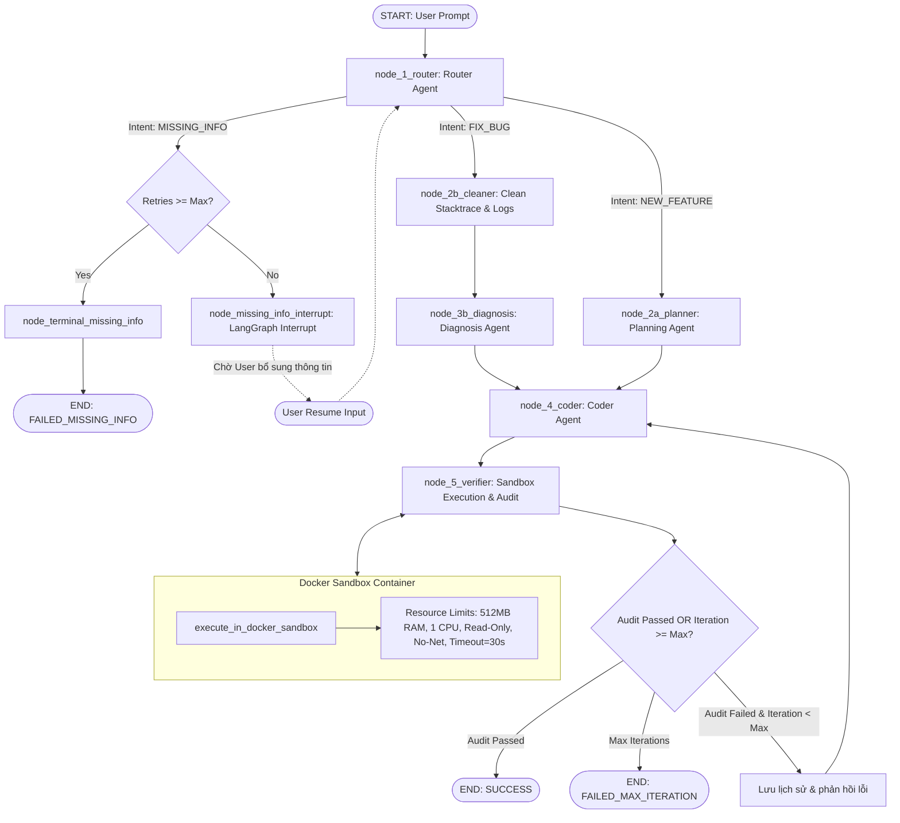

# AI Engineer Agent

Hệ thống AI Engineering Agent nâng cấp mô-đun hóa, hỗ trợ lập trình tự động, chẩn đoán bug, thực thi sandbox Docker và quản lý session với LangGraph persistent checkpointer.

## 📊 Kiến Trúc & Luồng Xử Lý (Workflow Diagram)

Sơ đồ tuần tự xử lý yêu cầu của Agent thông qua các node và sandbox an toàn:



## 📁 Cấu Trúc Thư Mục

```text
ai_engineer_agent/
├── schemas/
│   ├── __init__.py
│   └── payload.py          # Pydantic schemas (AgentState, CodeFixProposal, Audit,...)
├── llm/
│   ├── __init__.py
│   └── safe_call.py        # Wrapper gọi LLM an toàn, retry schema, đếm token
├── sandbox/
│   ├── __init__.py
│   └── docker_runner.py    # Sandbox cách ly chạy code trong Docker, giới hạn tài nguyên
├── agent/
│   ├── __init__.py
│   ├── nodes.py            # Các logic xử lý chính (Router, Planner, Coder, Verifier,...)
│   └── graph.py            # Định nghĩa StateGraph và cấu hình SqliteSaver Checkpointer
├── main.py                 # Khai báo API/Entrypoint (start_session, resume_session, cleanup)
├── agent_sessions.db       # SQLite DB lưu checkpoint (tự động sinh)
├── agent_sessions.db-wal   # SQLite WAL file (tự động sinh)
├── agent_sessions.db-shm   # SQLite Shared Memory file (tự động sinh)
├── .env                    # Biến môi trường (OPENAI_API_KEY, DB_PATH,...)
├── .gitignore              # Loại bỏ .db*, .env, __pycache__
├── requirements.txt        # Thư viện phụ thuộc (langgraph, langchain-openai, docker,...)
└── README.md               # Hướng dẫn thiết lập và khởi chạy
```

## 🛠️ Cài Đặt

1. **Cài đặt thư viện phụ thuộc:**
   ```bash
   pip install -r requirements.txt
   ```

2. **Chuẩn bị trước Docker Images (chạy offline/local execution):**
   ```bash
   docker pull python:3.11-slim
   docker pull node:20-slim
   ```

3. **Cấu hình biến môi trường (`.env`):**
   Tạo hoặc chỉnh sửa file `.env`:
   ```env
   OPENAI_API_KEY=your_openai_api_key_here
   DB_PATH=agent_sessions.db
   ```

## 🚀 Khởi Chạy

Chạy trực tiếp module chính:
```bash
python main.py
```

## 🧹 Database Maintenance & Thread Safety (FastAPI)

Hệ thống sử dụng SQLite Checkpointer ở chế độ **WAL Mode** kết hợp cùng `threading.RLock()` (`db_lock`) để đồng bộ hóa truy cập checkpoint DB giữa các thread.

> ⚠️ **Kiến trúc Trade-off**: `SqliteSaver` (sync, dùng chung 1 connection) được thiết kế cho single-writer. Với `db_lock` bao quanh `graph.stream()`, mỗi session chạy **tuần tự** — tại một thời điểm chỉ 1 session thực thi LLM + Docker, các request khác xếp hàng chờ. Đây là đánh đổi an toàn-tuyệt-đối cho concurrency. Nếu cần throughput cao hơn (nhiều user thật), xem xét: (1) `AsyncSqliteSaver` + FastAPI async endpoints, (2) mỗi thread/request một connection SQLite riêng (WAL + OS file-lock đã hỗ trợ), hoặc (3) `langgraph-checkpoint-postgres`.

Đồng thời, module `main.py` hỗ trợ **Lazy Initialization** cho LLM và Graph, cho phép import module để unit test mà không bị gián đoạn nếu biến môi trường `OPENAI_API_KEY` chưa được khởi tạo.

Các hàm quản lý vòng đời database được cung cấp trong `main.py`:

### 1. Xóa checkpoint của 1 thread cụ thể
```python
from main import delete_thread_data

# Xóa checkpoint history của thread cụ thể để giải phóng dung lượng
delete_thread_data(thread_id="session_001")
```

### 2. Dọn dẹp các checkpoint cũ (theo ngày)
```python
from main import cleanup_old_sessions

# Xóa các checkpoint cũ hơn 7 ngày và TRUNCATE WAL để gom file
cleanup_old_sessions(days_retention=7)
```

### 3. Đóng kết nối an toàn (flush WAL)
```python
from main import close_db_connection

# Flush WAL vào file .db chính trước khi đóng ứng dụng
close_db_connection()
```

### 4. Tùy chọn Auto-Cleanup trong Session API
```python
from main import start_agent_session, resume_agent_session

# auto_cleanup=True: Tự động xóa checkpoint ngay khi session kết thúc
res = start_agent_session(thread_id="session_002", user_input="Sửa bug...", auto_cleanup=True)
# Hoặc khi resume:
res = resume_agent_session(thread_id="session_002", user_answer={...}, auto_cleanup=True)
```
